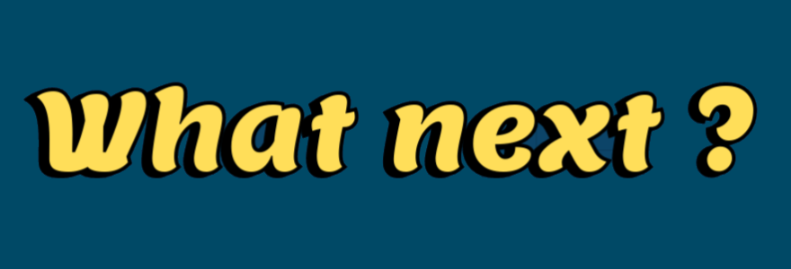
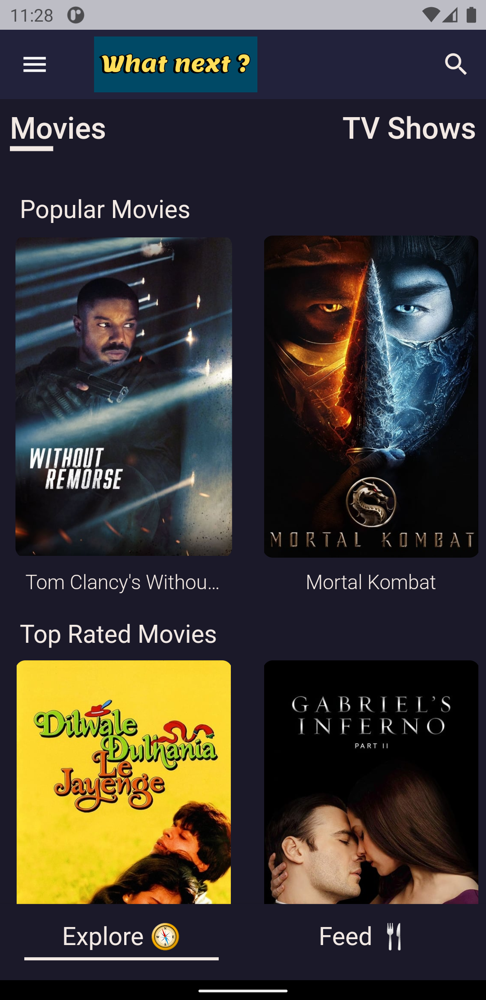
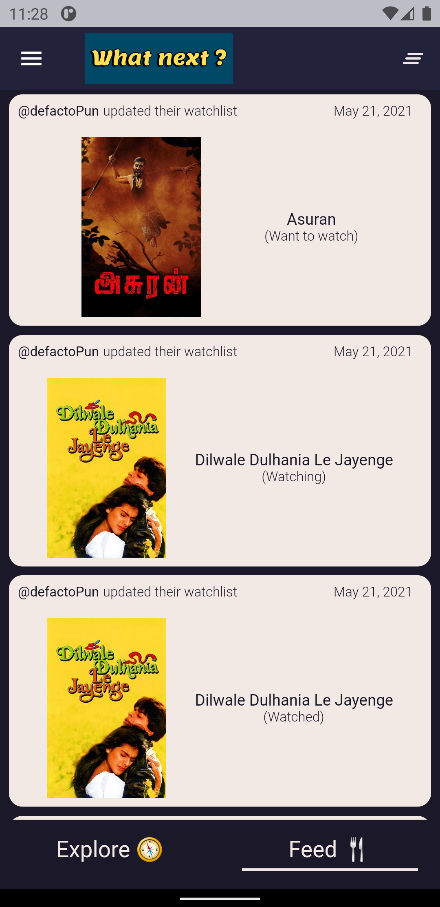
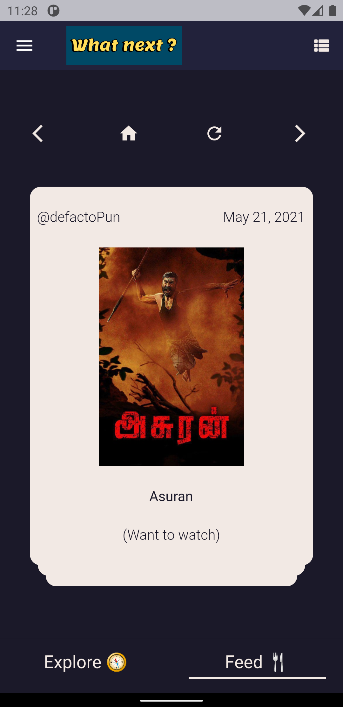
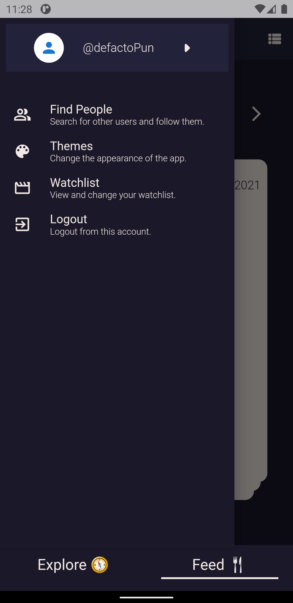
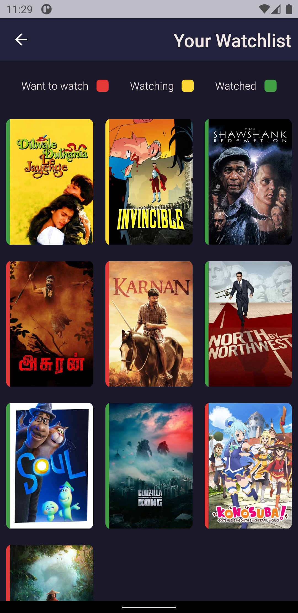
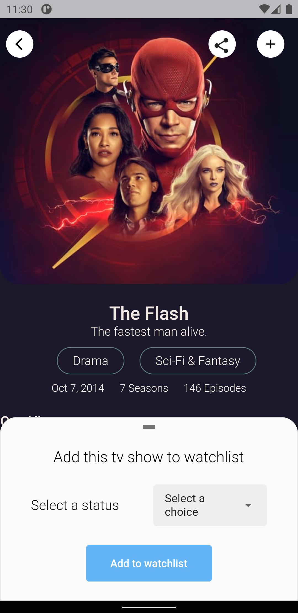
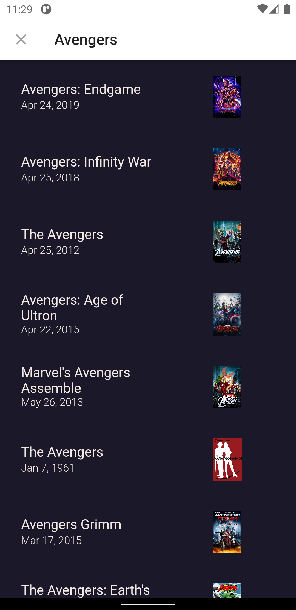
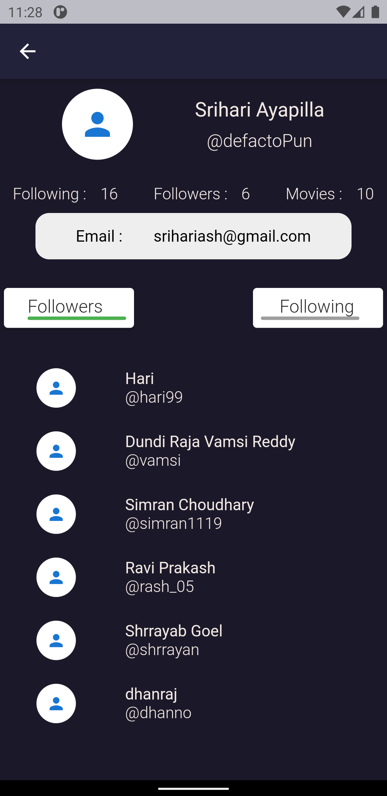
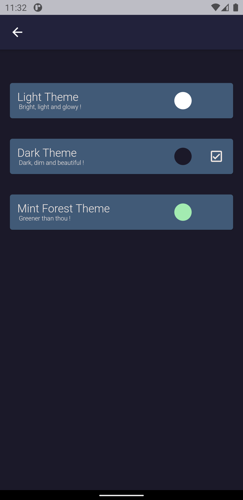

# What next ?

<p float="left">
  
 
   <a href='https://play.google.com/store/apps/details?id=app.zepplaud.whatnext'></a>
</p>

 

What next is a social platform to track your movie and tv shows consumption and socialize with your friends to see their watchlists.

## Tech Stack:

- Flutter
- Dart
- Firebase

## Features:

This project is still in development stage. So, feature requests are welcome. Feel free to open an issue if you have something in mind or if something is not working right. it might make a large impact 💓

- [x] Make watch lists with watching status.
- [x] Movies and Tv Shows listing (popular ones are shown cuurrently)
- [x] Search for a movie or TV show.
- [x] Search, view and follow other users.
- [X] Themes 
- [ ] UI polishing to look decent.
- [ ] Send suggestions and messages to other users.
- [ ] Invite people to the app via other mediums.
- [x] Share a movie/Tv show to other apps.
- [ ] Add comments or thoughts to the watchlist items visible to user's friends or all.
- [x] Create a feed with the updates from people's watchlists.


## How to setup locally ?

1. Fork the repo.

2. Clone the repo using the forked repo.

3. Open the code in your favorite code editor.

4. Install the dependencies using the following command:

```
$ flutter pub get
```
5. Add your TMDB API keys in a file named 'api_keys.dart' and place it inside /lib/constants 
 
```
const String v3 = "XXXXXXXXX";
const String v4 = "XXXXXXXXX";

```

6. Setup up a project in firebase using structure specified (details will be provided soon) and link your app with firebase. (google-services.json) 

7. Build the app using the following command:

```
$ flutter run
```

## Interested in contributing ?

See the [contributor's guide!](contributing.md)


## Screenshots
  |  |  


   |  |    


   |  |    


## Questions or issues ?

If you have general question about the project. Feel free to open an issue regarding your query/issue.

### Learn Flutter ?

Follow this [link](https://flutter.dev/)
